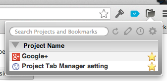

# Welcome to Project Tab Manager!
* Have you been opening 100 tabs on your Chrome?
* Consuming gigabytes of memory just by running Chrome?
* Distracted by social media while you are working because they are open in other tabs?

Worry no more! Project Tab Manager (PTM) helps you solve those problems!

## Getting Started
Here's the first thing you should do to get started with PTM.

1. Open a new window.
2. Open a web page.
3. Open PTM by clicking on folder icon.
4. Enter a name of the window then save. This will be your first poject.
5. You're all set.

  
PTM is that simple. Whenever you want to resume the project, just click on the project name from PTM pop up. Try following to see how powerful this extension is.

1. Open new tabs in previously saved window.
2. Close the window (not tabs, but window itself).
3. Open PTM by clicking on folder icon.
4. Click on the saved project to resume.

  
You should now see the same tab sets restored. Got the idea? Enjoy!

## Further Instructions

### Saving bookmarks
* Saving project stores all tabs as bookmarks. PTM also track other tabs opened in the same window so that you can restore them by opening the project later. But what if you close one of those tabs and want to open it again? By bookmarking important tabs, you can easily come back to the same page.
* In PTM, bookmarks are actually saved as bookmarks on Chrome. Try opening Bookmark Manager and look for a folder named "Project Tab Manager" (default). You'll see list of bookmarks and folders (by project name) stored on PTM there.
* This enables you to access same bookmarks on Chrome for iOS and Chrome for Android, if you are signed in to Chrome.

### Editing Projects
* Editing project names, bookmark names, sorting are not supported on PTM.
* This is by design. You already have much better bookmark manager built into Chrome!

### Removing Projects
* By clicking on trash bin icon beside project name will remove the project.
* Removed bookmarks are not deleted. It's just moved to a special folder named "\_\_Archives\_\_".
* Delete folders and bookmarks under "\_\_Archives\_\_" manually if you think they are not important.

### Associating Project
* Sometimes you might want to assign a window to the existing project.
* Clicking on pin icon next to project names will associate the project with the window.
* Note this will discard previous session stored to the project.

### Lazy Loading
* Opening a lot of tabs may take a while and consumes memory on Chrome. Lazy Loading feature on PTM enables you to delay actual rendering of those tabs.
* Lazy loaded tabs will have title with "*" prefixed. They won't be loaded until you will activate them.
* You have an option to turn lazy loading feature off.

### Options
* In Options page, you can configure
    * Root bookmark folder of PTM
    * Root bookmark folder name
    * Lazy Loading switch

### Summary
* By clicking on clock icon on top of PTM pop up, you can see summary of time you spent on each projects.
* These summaries are stored for 2 month so that you can come back and see how much time you spent on which project.

### Keyboard Navigation
* After opening TPM pop up, you might want to nagivate using keyboard.
* Pressing "tab" selects next project, pressing "return" opens the selected project.
* You can optionally assign shortcut to open PTM pop up as well. Open "chrome://extensions" and go to bottom of the page to find "Keyboard shortcuts" then assign.

## Version history

### Version 2.1.0
* Refactored internal structure for better maintenance.
* Project order is now aligned to what appears on actual bookmark list.
* Session handling is significantly improved.
* Slight design change.

### Version 2.0.5
* Pop up history page only if the version changes in major (ex 2.0.0) or minor (ex 2.1.0). Trivial change (ex 2.1.1) won't popu up anymore.

### Version 2.0.4
* Added link to Japanese help (I mean, my blog!)
* Fixed cache strength on session changes

### Version 2.0.3
* Opening pop up is now much much faster.

### Version 2.0.2
* Quick fix on bookmark initialization.

### Version 2.0.1
* Bug fixes.
    * Console logs are now disabled.
    * Summary works better.
    * History log will be removed after 2 month.
    * Options were busted. Now it works ok.

### Version 2.0.0
* Project Tab Manager has got a major update. Check out these killer features!
* Enhanced UI. Project Tab Manager UI has got much better, more intuitive and friendlier than before.
* Project Tab Manager now tracks all your open tabs. Feel free to close windows. You can always resume from where you were by opening the same project. Bookmark by turning on stars beside your open tab list under project if you think you will open it again.
* Automatically restores previous sessions and project assignments to windows.
* Keyboard navigation is now available. Open Project Tab Manager, search, then you can navigate through projects by pressing "tab" key. Press "return" to open selected project.
* Options is now stored in the cloud. Your configurations will be consistent among all your environments (if you are signed into Chrome).
* Better summary. You can now summarize your time spent on each projects better. Your session will be tracked for 2 months.

### Version 1.0.3
* Fixed wrong passive bookmark representation.
* Fixed wrong behavior on lazy load.
* other bug fixes.

### Version 1.0.2
* Fixed blocking bug causing no response when clicking on session name.